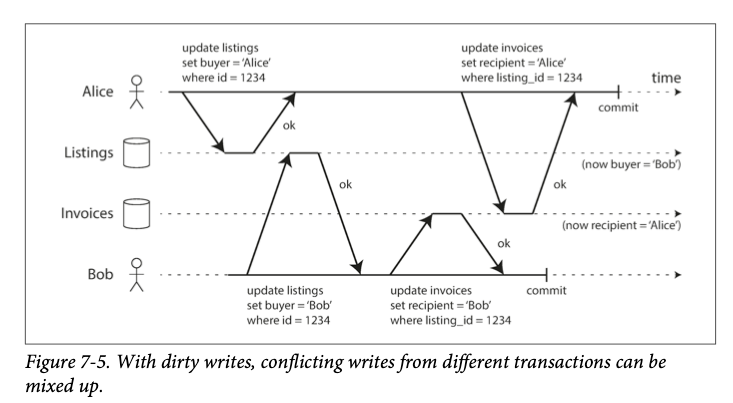
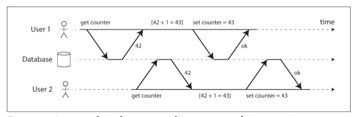
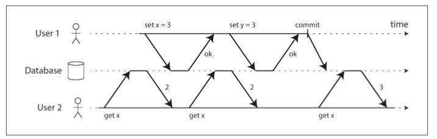

# 트랜잭션
- `트랜잭션 없이 코딩하는 것보다 트랜잭션을 과용해서 병목지점이 생기는 성능 문제를 애플리케이션 프로그래머가 처리하게 하는 게 낫다고 생각한다`
  
- 트랜잭션: 전체가 성공(커밋) 하거나 실패(abort, rollback)
  
- 현실에서의 문제
    - 잠재적인 오류 시나리오(일련의 처리 진행중 장애 발생하여 끊김)
      - DB에 write 하는 도중 DB가 죽는 경우 
    - 동시성 문제
      - 여러 클라이언트가 동시에 DB에 write 해서 다른 클라이언트가 쓴 내용을 덮는 경우
    
- 위의 현실 문제를 해결하기 위해 트랜잭션이라는 개념을 사용
    - 무조건 적용하는게 좋은건 아님.
    - 트랜잭션이 필요하지 않은 상황에선 트랜잭션 보장 완화하거나 아예 쓰지 않는 게 이득
    - 예를들어, 성능을 향상 시키거나 가용성을 높일 수 있다. 
    
- 안전성 보장(safety guarantee)
    - 트랜잭션을 사용함으로써 애플리케이션에서 어느 정도의 잠재적인 오류 시나리오와 동시성 문제를 무시할 수 있다.
    
- ACID
    - 트랜잭션이 제공하는 안전성 보장을 의미하는 약어
    - DB에서 내결함성 메커니즘을 나타내는 정확한 용어를 확립하기 위해 테오 하더, 안데르아스 로이터가 만듦.
    
- 원자성(atomicity)
    - 일련의 동작 중 중지된다면 실행하기 이전으로 돌리는 특징     
    - 어보트 능력(abortability)가 더 적합한 단어일 수 있다.
    - 트랜잭션이 어보트 됐다면 애플리케이션에서 이 트랜잭션이 어떤 것도 변경하지 않았음을 알 수 있으므로 안전하게 재시도할 수 있다.

- 일관성(consistency)
    - 항상 진실이어야 하는, 데이터에 관한 어떤 선언(불변식, invariant)이 있다는 것.
        - ex. 회계 시스템에서 모든 계좌에 걸친 대변과 차변은 항상 맞아떨어져야 한다. 
    - DB가 보장할 수 있는 특징이 아님. 애플리케이션에서 올바르게 정의해야 함.(ACID 중 유일하게 애플리케이션 속성)

- 격리성(isolation)
  - 동시에 실행되는 트랜잭션은 서로 격리된다. 트랜잭션은 다른 트랜잭션을 방해할 수 없다. 
  - 동시성 문제(race condition) 해결 -> 격리수준

- 지속성(durability)
  - 트랜잭션이 성공적으로 커밋됐다면 하드웨어 결함이 발생하거나 데이터베이스가 죽더라도 트랜잭션에서 기록한 모든 데이터는 손실되지 않는다는 보장
  - 지속성을 보장하려면 데이터베이스는 트랜잭션이 성공적으로 커시됐다고 보고하기전에 쓰기나 복제가 완료될 때까지 기다려야 한다.
  - 현실에서 절대적인 보장은 없다. 위험을 줄이려는 기법이 여러 있을 뿐(복제, 디스크 쓰기, 백업 등)
  - 항상 이론적인 "보장"은 약간 에누리해서 듣는게 현명하다
  
- 다중 객체 연산
  - 여러개의 객체를 변경해야할 경우
    - ex) 
      - 이메일 애플리케이션. 새 메시지가 올 때마다 읽지 않은 메시지 개수 증가도 해야하고, 읽지 않은 메시지를 별개의 필드에 저장도 할 수 있다. 
      - 인덱스가 있는 테이블에 데이터를 삽입하면, 테이블도 변경이 발생하고, 인덱스에도 변경이 발생한다.
  - 원자성, 격리성이 필요
  - 트랜잭션은 보통 다중 객체에 대한 다중 연산을 하나의 실행 단위로 묶는 메커니즘으로 이해된다.
  - 많은 분산 데이터스토어는 다중 객체 트랜잭션 지원을 포기했다. 다중 객체 트랜잭션은 여러 파티션에 걸쳐서 구현하기 어렵고, 매우 높은 가용성과 성능이 필요한 곳에서는 방해가 되는 시나리오도 있기 때문.
- 단일 객체 연산
  - 원자성과 격리성은 여기에도 적용된다
  - 원자성: 장애 복구용 로그를 써서 구현 가능
  - 격리성: 각 객체에 잠금을 사용해 구현

- 오류와 어보트 처리
  - 트랜잭션의 핵심기능: 오류가 생기면 어보트 되고 안전하게 재시도할 수 있게 한다.
  - 모든 시스템이 이 철학은 따르지 않음. 
    - best effort 원칙: 데이터베이스는 가능한 모든 것을 할 것이며, 그 때문에 오류가 발생 하면 이미 한 일은 취소 하지 않는다.
    - 특히 리더 없는 복제를 사용하는 데이터 스토어에서 이러함

- 완화된 격리 수준
  - 동시성 문제는 트랜잭션이 다른 트랜잭션에서 동시에 변경한 데이터를 읽거나 두 트랜잭션이 동시에 같은 데이터를 변경하려고 할 때 발생
  - 동시성 버그는 타이밍에 운이 없을 때만 촉발되므로 테스트로 발견하기 어렵다
  - 데이터베이스는 트랜잭션 격리를 통해 동시성 문제를 감추려고 했음.
  - 특히 직렬성 격리는 여러 트랜잭션들이 직렬적으로 실행되는 것과 동일한 결과가 나오도록 보장. 대신 성능 비용이 있고, 많은 데이터베이스들은 그 비용을 지불하려 하지 않는다. 
  - 특정 동시성 이슈로부턴 보호해주지만 모든 이슈로부터 보호해주진 않는 완화된 격리 수준을 사용하는 시스템이 흔하다. 

- 격리 수준
  - 커밋 후 읽기
    - 가장 기본적인 수준의 트랜잭션 격리. 아래 내용을 보장한다. 
      - 더티 읽기 방지(데이터베이스에서 읽을 때 커밋된 데이터만 보게 된다)
        - 더티 읽기 방지가 안되면 한 트랜잭션이 여러 객체를 수정할 때, 다른 트랜잭션 입장에선 어느 객체는 수정된 내용을 보고, 다른 객체는 수정되지 않은 내용을 보는것을 방지
          - ex) 이메일 발송. 새 이메일 내용이 추가되고, 안읽은 메일 갯수도 +1 되어야 한다. 그런데 이 트랜잭션 와중에 다른 트랜잭션이 읽기를 시도하면 새 이메일 내용은 보이는데 안읽은 메일 갯수는 그대로인 상황을 마주할 수도 있다.
        - 트랜잭션이 어보트 되는 경우, 더티 읽기 방지가 안되면 롤백될 데이터를 다른 트랜잭션에서 읽을 수도 있다. 
      - 더티 쓰기 방지(데이터베이스에서 쓸 때 커밋된 데이터만 덮어쓰게 된다)
        - 일반적으로 나중에 쓴 내용이 먼저 쓴 내용을 덮어쓴다고 가정
        - 더티 쓰기: 먼저 쓴 내용이 커밋되지 않은 트랜잭션에서 쓴 것이고, 나중에 실행된 쓰기 작업이 커밋되지 않은 값을 덮어써버리는 문제
        - 
        - 그런데 이런 카운터 문제는 해결하지 못한다. 이미 User1이 커밋한 내용에 대해 쓰기를 하는 것이기 때문
          -  
    - 구현
      - 오라클 11g, postgresql, SQL서버 2012, MemSQL 등 여러 DB에서 기본 설정
      - 더티 쓰기
        - 로우 수준 잠금을 통한 방법
          - 트랜잭션에서 특정 객체를 변경하고 싶다면 잠금을 우선 획득
          - 트랜잭션이 커밋되거나 어보트될 때 까지 잠금을 보유해야 함
          - 오직 한 트랜잭션만 어떤 주어진 객체에 대한 잠금 보유 가능
          - 뮤텍스 같은 느낌이네
      - 더티 읽기
        - 뮤텍스 방법을 쓸수도 있지만, 읽기만 실행하는 여러 트랜잭션들이 오래 실행되는 쓰기 트랜잭션 하나가 완료될 때 까지 기다려야할 수 있어서 현실에선 운용성이 나쁘다
        - 대부분의 DB는 아래 방법 사용
          - DB는 과거에 커밋된 값과 현재 쓰기 잠금을 갖고 있는 트랜잭션에서 쓴 새로운 값을 모두 기억
          - 해당 트랜잭션이 실행중인 동안은 그 객체를 읽는 다른 트랜잭션들은 과거의 값을 읽게 됨.
          - 
  - 스냅숏 격리와 반복 읽기