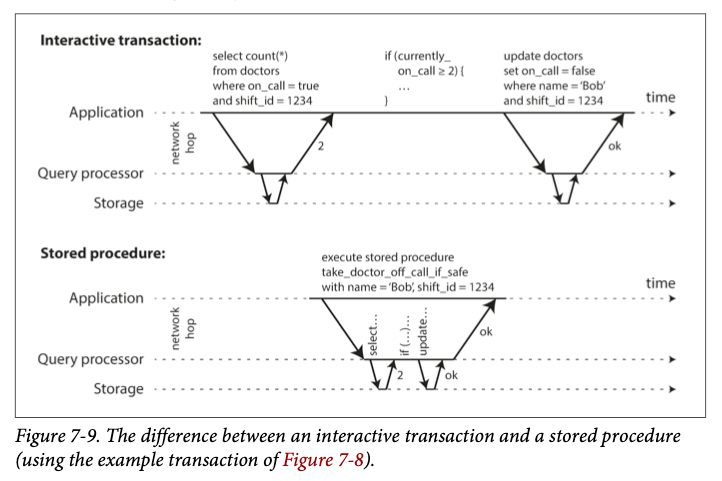

# 트랜잭션
- `트랜잭션 없이 코딩하는 것보다 트랜잭션을 과용해서 병목지점이 생기는 성능 문제를 애플리케이션 프로그래머가 처리하게 하는 게 낫다고 생각한다`
  
- 트랜잭션: 전체가 성공(커밋) 하거나 실패(abort, rollback)
  
- 현실에서의 문제
    - 잠재적인 오류 시나리오(일련의 처리 진행중 장애 발생하여 끊김)
      - DB에 write 하는 도중 DB가 죽는 경우 
    - 동시성 문제
      - 여러 클라이언트가 동시에 DB에 write 해서 다른 클라이언트가 쓴 내용을 덮는 경우
    
- 위의 현실 문제를 해결하기 위해 트랜잭션이라는 개념을 사용
    - 무조건 적용하는게 좋은건 아님.
    - 트랜잭션이 필요하지 않은 상황에선 트랜잭션 보장 완화하거나 아예 쓰지 않는 게 이득
    - 예를들어, 성능을 향상 시키거나 가용성을 높일 수 있다. 
    
- 안전성 보장(safety guarantee)
    - 트랜잭션을 사용함으로써 애플리케이션에서 어느 정도의 잠재적인 오류 시나리오와 동시성 문제를 무시할 수 있다.
    
- ACID
    - 트랜잭션이 제공하는 안전성 보장을 의미하는 약어
    - DB에서 내결함성 메커니즘을 나타내는 정확한 용어를 확립하기 위해 테오 하더, 안데르아스 로이터가 만듦.
    
- 원자성(atomicity)
    - 일련의 동작 중 중지된다면 실행하기 이전으로 돌리는 특징     
    - 어보트 능력(abortability)가 더 적합한 단어일 수 있다.
    - 트랜잭션이 어보트 됐다면 애플리케이션에서 이 트랜잭션이 어떤 것도 변경하지 않았음을 알 수 있으므로 안전하게 재시도할 수 있다.

- 일관성(consistency)
    - 항상 진실이어야 하는, 데이터에 관한 어떤 선언(불변식, invariant)이 있다는 것.
        - ex. 회계 시스템에서 모든 계좌에 걸친 대변과 차변은 항상 맞아떨어져야 한다. 
    - DB가 보장할 수 있는 특징이 아님. 애플리케이션에서 올바르게 정의해야 함.(ACID 중 유일하게 애플리케이션 속성)

- 격리성(isolation)
  - 동시에 실행되는 트랜잭션은 서로 격리된다. 트랜잭션은 다른 트랜잭션을 방해할 수 없다. 
  - 동시성 문제(race condition) 해결 -> 격리수준

- 지속성(durability)
  - 트랜잭션이 성공적으로 커밋됐다면 하드웨어 결함이 발생하거나 데이터베이스가 죽더라도 트랜잭션에서 기록한 모든 데이터는 손실되지 않는다는 보장
  - 지속성을 보장하려면 데이터베이스는 트랜잭션이 성공적으로 커시됐다고 보고하기전에 쓰기나 복제가 완료될 때까지 기다려야 한다.
  - 현실에서 절대적인 보장은 없다. 위험을 줄이려는 기법이 여러 있을 뿐(복제, 디스크 쓰기, 백업 등)
  - 항상 이론적인 "보장"은 약간 에누리해서 듣는게 현명하다
  
- 다중 객체 연산
  - 여러개의 객체를 변경해야할 경우
    - ex) 
      - 이메일 애플리케이션. 새 메시지가 올 때마다 읽지 않은 메시지 개수 증가도 해야하고, 읽지 않은 메시지를 별개의 필드에 저장도 할 수 있다. 
      - 인덱스가 있는 테이블에 데이터를 삽입하면, 테이블도 변경이 발생하고, 인덱스에도 변경이 발생한다.
  - 원자성, 격리성이 필요
  - 트랜잭션은 보통 다중 객체에 대한 다중 연산을 하나의 실행 단위로 묶는 메커니즘으로 이해된다.
  - 많은 분산 데이터스토어는 다중 객체 트랜잭션 지원을 포기했다. 다중 객체 트랜잭션은 여러 파티션에 걸쳐서 구현하기 어렵고, 매우 높은 가용성과 성능이 필요한 곳에서는 방해가 되는 시나리오도 있기 때문.
- 단일 객체 연산
  - 원자성과 격리성은 여기에도 적용된다
  - 원자성: 장애 복구용 로그를 써서 구현 가능
  - 격리성: 각 객체에 잠금을 사용해 구현

- 오류와 어보트 처리
  - 트랜잭션의 핵심기능: 오류가 생기면 어보트 되고 안전하게 재시도할 수 있게 한다.
  - 모든 시스템이 이 철학은 따르지 않음. 
    - best effort 원칙: 데이터베이스는 가능한 모든 것을 할 것이며, 그 때문에 오류가 발생 하면 이미 한 일은 취소 하지 않는다.
    - 특히 리더 없는 복제를 사용하는 데이터 스토어에서 이러함

- 완화된 격리 수준
  - 동시성 문제는 트랜잭션이 다른 트랜잭션에서 동시에 변경한 데이터를 읽거나 두 트랜잭션이 동시에 같은 데이터를 변경하려고 할 때 발생
  - 동시성 버그는 타이밍에 운이 없을 때만 촉발되므로 테스트로 발견하기 어렵다
  - 데이터베이스는 트랜잭션 격리를 통해 동시성 문제를 감추려고 했음.
  - 특히 직렬성 격리는 여러 트랜잭션들이 직렬적으로 실행되는 것과 동일한 결과가 나오도록 보장. 대신 성능 비용이 있고, 많은 데이터베이스들은 그 비용을 지불하려 하지 않는다. 
  - 특정 동시성 이슈로부턴 보호해주지만 모든 이슈로부터 보호해주진 않는 완화된 격리 수준을 사용하는 시스템이 흔하다. 

- 격리 수준
  - 커밋 후 읽기
    - 가장 기본적인 수준의 트랜잭션 격리. 아래 내용을 보장한다. 
      - 더티 읽기 방지(데이터베이스에서 읽을 때 커밋된 데이터만 보게 된다)
        - 더티 읽기 방지가 안되면 한 트랜잭션이 여러 객체를 수정할 때, 다른 트랜잭션 입장에선 어느 객체는 수정된 내용을 보고, 다른 객체는 수정되지 않은 내용을 보는것을 방지
          - ex) 이메일 발송. 새 이메일 내용이 추가되고, 안읽은 메일 갯수도 +1 되어야 한다. 그런데 이 트랜잭션 와중에 다른 트랜잭션이 읽기를 시도하면 새 이메일 내용은 보이는데 안읽은 메일 갯수는 그대로인 상황을 마주할 수도 있다.
        - 트랜잭션이 어보트 되는 경우, 더티 읽기 방지가 안되면 롤백될 데이터를 다른 트랜잭션에서 읽을 수도 있다. 
      - 더티 쓰기 방지(데이터베이스에서 쓸 때 커밋된 데이터만 덮어쓰게 된다)
        - 일반적으로 나중에 쓴 내용이 먼저 쓴 내용을 덮어쓴다고 가정
        - 더티 쓰기: 먼저 쓴 내용이 커밋되지 않은 트랜잭션에서 쓴 것이고, 나중에 실행된 쓰기 작업이 커밋되지 않은 값을 덮어써버리는 문제
        - 
        - 그런데 이런 카운터 문제는 해결하지 못한다. 이미 User1이 커밋한 내용에 대해 쓰기를 하는 것이기 때문
          -  
    - 구현
      - 오라클 11g, postgresql, SQL서버 2012, MemSQL 등 여러 DB에서 기본 설정
      - 더티 쓰기
        - 로우 수준 잠금을 통한 방법
          - 트랜잭션에서 특정 객체를 변경하고 싶다면 잠금을 우선 획득
          - 트랜잭션이 커밋되거나 어보트될 때 까지 잠금을 보유해야 함
          - 오직 한 트랜잭션만 어떤 주어진 객체에 대한 잠금 보유 가능
          - 뮤텍스 같은 느낌이네
      - 더티 읽기
        - 뮤텍스 방법을 쓸수도 있지만, 읽기만 실행하는 여러 트랜잭션들이 오래 실행되는 쓰기 트랜잭션 하나가 완료될 때 까지 기다려야할 수 있어서 현실에선 운용성이 나쁘다
        - 대부분의 DB는 아래 방법 사용
          - DB는 과거에 커밋된 값과 현재 쓰기 잠금을 갖고 있는 트랜잭션에서 쓴 새로운 값을 모두 기억
          - 해당 트랜잭션이 실행중인 동안은 그 객체를 읽는 다른 트랜잭션들은 과거의 값을 읽게 됨.
          - 
  - 스냅숏 격리와 반복 읽기
    - 커밋 후 읽기를 사용해도 여전히 동시성 버그가 있을 수 있다. 아래는 그 예
      - 
      - 잠시동안 엘리스 입장에선 100 달러가 사라진 것 처럼 보일 수 있다. 일관성(정합성) 깨짐
      - 이런 현상을 비반복 읽기(nonrepeatable read), 읽기 스큐(read skew)라고 한다. 
      - 몇초 후 다시 새로고침하면 일관성있어 보임
    - 일시적인 비일관성을 감내할 수 없는 경우
      - 백업: 백업 프로세스 중에도 DB에 계속 쓰기가 실행됨. 그때 읽기 스큐 상황이 있다면 이런 비일관성이 영속적이게 된다 
      - 분석 질의와 무결성 확인: 데이터베이스의 큰 부분을 스캔하는 질의를 실행할 때(즉 오래 걸리는). 다른 시점의 데이터베이스 일부를 보면 비일관성 발생
    - 스냅숏 격리: 각 트랜잭션은 데이터베이스의 일관된 스냅숏으로부터 읽는다
    - 이것도 널리 쓰이는 기능임. postgresql, InnoDB 저장소 엔진을 쓰는 MySQL, Oracle 등 사용
    - 구현
      - 쓰기: 커밋 후 읽기 처럼 쓰기 잠금을 사용
      - 핵심원리: 읽는 쪽에서 쓰는 쪽을 차단하지 않고, 쓰는 쪽에서 읽는 쪽을 차단하지 않는다
      - 읽기
        - 데이터베이스는 객체마다 커밋된 버전 여러개를 유지한다 -> 다중 버전 동시성 제어 (MVCC, multi-version concurrency control)
        - 커밋후 읽기가 객체마다 두개씩만 유지하는 것과 다름
        - 
    - 일관된 스냅숏을 보는 가시성 규칙
      - 각 트랜잭션을 시작할 때 그 시점에 진행중인 트랜잭션 목록을 만들고, 이 트랜잭션이 쓴 데이터는 모두 무시한다
      - 어보트된 트랜잭션이 쓴 데이터는 무시한다
      - 트랜잭션 ID가 더 큰 트랜잭션이 쓴 데이터는 커밋 여부에 관계없이 무시
      - 그 밖의 모든 데이터는 애플리케이션의 질의로 볼 수 있음.
    - 색인과 스냅숏 격리
      - 단순한 방법: 색인이 객체의 모든 버전을 가리키게 하고, 현재 트랜잭션에서 볼 수 없는 버전을 걸러내는 것
      - 몇몇 데이터베이스의 세부 구현이 소개 되어 있는데, 필기까지 할 필요는 없을듯
    - 반복 읽기와 혼란스러운 이름
      - 스냅숏 격리 == 반복 읽기 == 직렬성
      - 스냅숏 격리를 구현한 많은 데이터베이스에서 서로 다른 이름으로 이를 부름. 오라클에선 직렬성, mySQL에선 반복 읽기
  - 갱신 손실 방지
    - 갱신 손실(lost update): 쓰기 트랜잭션 사이에 발생할 수 있는 이슈 유형. 스냅숏 격리나 커밋후 읽기로 해결 안됨.
      - DB에서 값을 읽고 변경, 이후 변경된 값을 다시 쓰는 작업(Read-modify-write 주기)이 동시에 여러곳에서 일어나는 경우 발생
      - 예
        - 위키에서 두명의 사용자가 동시에 같은 페이지 편집
        - 카운터를 증가시키거나 계좌 잔고 갱신
    - 해결책
      - 원자적 쓰기연산
        - read-modify-write 주기를 없애줌. 
        - 예) RDB UPDATE 문
        - 대부분의 RDB에서 동시성 안전(concurrency-safe)하다
        - 보통 객체를 읽을 때 그 객체에 독점적인(execlusive) 잠금을 획득해서 구현
          - 커서 안정성(cursor stability) 라고도 한다.
          - 근데 이거 스냅숏 격리나, 커밋후 읽기에서 봤던 방법이랑 그냥 똑같지 않나?
            - 걔들은 쓰기만 막는거지만 여긴 읽지도 못하게 한다고 되어 있음.
          - 다른 선택지는 그냥 모든 원자적 연산을 단일 스레드에서 실행하도록 하는것 (병렬 처리가 아니게 된다)
        - ORM 프레임워크 쓰면 DB가 제공하는 원자적 연산 대신 read-modify-write 주기 실행하는 코드 작성하기 쉽다
          - 자신이 뭘 하고 있는지 알고 있으면 문제가 아니지만 잠재적으로는 테스트로 발견하기 어려운 버그 원인이 될 수 있다.
      - 명시적인 잠금
        - 애플리케이션에서 갱신할 객체를 명시적으로 잠그는 것
        - 애플리케이션이 read-modify-write 주기를 수행하고 다른 트랜잭션이 동시에 같은 객체를 읽으려고 하면, 첫번째 rmw 주기가 완료될 때까지 기다리도록 강제된다.
      - 갱신 손실 자동 감지
        - rmw 주기 병렬 실행을 허용하고 트랜잭션 관리자가(보통 DB) 갱신 손실을 발견하면 트랜잭션을 어보트 시키고 rmw 주기를 재시도하도록 갖에하는 방법
        - 스냅숏 격리와 결합해 효율적으로 수행 가능
        - 실제로 Postgresql의 반복 읽기, 오라클의 직렬성, SQL 서버의 스냅숏 격리 수준은 갱신 손실 발생하면 자동 발견해서 문제가 되는 트랜잭션을 어보트시킨다.
        - 그러나 MySQL, InnoDB는 반복읽기에서 갱신 손실 감지하지 않는다. 
      - Compare-and-set
        - 값을 마지막으로 읽은 후로부터 변경되지 않았을 때만 갱신을 허용
        - 이전에 읽은 값과 다르면 갱신은 반영되지 않고 rmw 주기 재시도
        - 예) 두 명의 사용자가 동시에 같은 위키 페이지를 갱신하지 못하도록 할 때
          - UPDATE wiki_pages SET content='new content' WHERE id=1234 AND content='old content'
      - 충돌 해소와 복제
        - 복제가 적용된 DB에선, 여러 노드에 있는 복사본 데이터가 다른 노드들에게서 동시에 변경 될 수 있으므로 갱신 손실 방지를 위한 추가 단계가 필요
        - 방법
          - 쓰기가 동시에 실행될 때 한 값에 대해 여러개의 충돌된 버전(형제(sibling))을 생성하는 것을 허용. 사후에 애플리케이션 코드나 특별한 데이터 구조를 사용해 충돌을 해소하고 이 버전들을 병합하는 것.
          - 원자적 연산: 특히 교환 법칙이 성립하는 연산이라면 잘 동작.
            - 교환법칙 성립 케이스: 다른 복제본에 다른 순서로 연산을 적용해도 같은 결과가 나온는 경우
          - 잠금과 compare-and-set은 최신 복사본이 하나만 있다고 가정하는 경우라 잘 동작하지 않음
        - 최종 쓰기 승리(last write wins, LWW) 충돌해소 방법은 갱신 손실 발생하기 쉽다.
          - 많은 복제 DB는 LWW가 기본 설정
  - 쓰기 스큐와 팬텀
    - 쓰기 스큐 예시
      - 의사의 호출 대기 상황 (최소 1명은 대기해야하는데, 2명 이상 대기중이면 한명은 아플경우 대기에서 빠질 수 있음.)
      - 회의실 예약 시스템(동시에 같은 회의실을 중복 예약할 수 없게 하고 싶음)
    - 
    - 두 트랜잭션이 두 개의 다른 객체를 갱신하므로(엘리스 row, 밥 row) 더티 쓰기도 갱신 손실도 아니다.
    - 쓰기 스큐 해법
      - 특정 데이터베이스는 제약 조건 설정을 통해 해결 가능(트리거, 구체화 뷰 등)
      - 트랜잭션이 의존하는 로우를 명시적으로 잠그는 것이 차선책. 
    - 팬텀: 어떤 트랜잭션이 실행한 쓰기가 다른 트랜잭션의 검색 질의 결과를 바꾸는 효과
      - 패턴
        - SELECT 질의가 어떤 검색 조건에 부합하는 로우를 검색하여 요구사항을 만족하는지 확인
        - 질의 결과에 따라 애플리케이션 코드는 어떻게 진행할지 결정
        - 애플리케이션이 계속 처리하기로 했다면 데이터베이스에 쓰고 트랜잭션을 커밋(이 쓰기의 효과로 2단계를 결정한 전제 조건이 바뀐다)
          - 예를들어 대기중인 의사의 수가 2명에서 1명이 되었다.
    - 충돌 구체화
      - 팬텀의 문제가 잠글 수 있는 객체가 없는 것이라, 인위적으로 데이터베이스에 잠금 객체를 추가하는 방법
      - 예) 회의실 예약의 경우, 시간 슬롯과 회의실에 대한 테이블을 만드는 것
        - 이제 예약을 하는 트랜잭션은 테이블에서 원하는 회의실과 시간 범위에 해당하는 로우를 잠글 수 있다.(SELECT FOR UPDATEE)
      - 충돌을 구체화하는 방법은 알아내기 어렵고, 오류가 발생하기 쉽다. 그리고 동시성 제어 메커니즘이 애플리케이션 데이터모델로 새어 나오는 것도 보기 좋지 않다. 
      - 다른 대안이 불가능할 때 최후의 수단으로 고려해야 한다.
  - 직렬성
    - 격리 수준의 단점(완화된 격리 수준이 처음 소개된 1970년대부터 있던 문제)
      - 격리수준은 이해하기 어렵고, DB마다 그 구현에 일관성이 없다
      - 애플리케이션 코드를 보고 특정한 격리 수준에서 해당 코드 실행이 안전한지 알기 어렵다
      - 경쟁 조건을 감지 하는데 도움이 되는 좋은 도구가 없다. 
    - 이런 상황에서 연구자들의 대답도 죽 간단했다. 직렬성 격리를 사용하라
    - 직렬성 격리
      - 보통 가장 강력한 격리 수준이라 여겨짐
      - 여러 트랜잭션이 실행되어도, 최종 결과는 항상 한번에 하나씩 직렬로 실행될 때와 같도록 보장함
      - 즉 데이터베이스에서 발생할 수 있는 모든 경쟁조건을 막아준다.
    - 오늘날 직렬성을 제공하는 데이터베이스는 대부분 아래 세 가지 기법 중 하나를 사용한다.
      - 말 그대로 트랜잭션을 순차적으로 실행하기
        - 뻔한 생각처럼 보이지만 2007년경에서야 DB 설계자들은 단일 스레드에서 트랜잭션을 실행하는게 가능하다고 결론 내렸다.
        - 몇가지 발전이 생각을 바꾸게 함
          - 램 가격 저렴 -> 데이터셋 전체를 메모리에 유지할 수 있을 정도가 됨.
          - OLTP 트랜잭션은 보통 짧고, 실행하는 읽기와 쓰기의 개수가 적다는걸 깨달음
          - OLAP에서의 오래 실행되는 분석 질의는 보통 읽기 전용이라 직렬 실행 루프 밖에서 일관된 스냅숏을 사용해 실행 가능
        - 적용 예: bolt db, redis, dataomic 등
        - 장단점
          - 잠금 코디네이션 오버헤드 피할 수 있음 -> 단일 스레드 시스템이 동시성 지원 시스템보다 성능이 나을 때도 있다.
          - 대신 CPU 코어 하나의 처리량으로 처리량이 제한됨.
          - 단일 스레드를 최대한 활용하려면 트랜잭션이 전통적인 형태와 다르게 구조화 되어야 한다.
        - 트랜잭션을 스토어드 프로시저 안에 캡슐화 하기
          - DB 초창기엔 트랜잭션 하나에 여러 활동이 들어가게 하려 했음(ex. 항공권 예약: 경로, 요금, 가용 좌석 탐색...)
          - 사람의 반응은 느리다 -> 트랜잭션이 대화식으로 사용자 응답 처리하는 것 회피 (모든 트랜잭션은 작고 빨라야 한다. 느린 트랜잭션 하나가 모든 트랜잭션 처리 지연 가능)
          - 즉 트랜잭션은 계속 상호 작용하는 클라/서버 스타일로 실행 -> 네트워크 통신에 많은 시간 소비
          - 단일 스레드 시스템들은 서로 상호 작용하는 다중 구문 트랜잭션 허용하지 않음.
          - -> 스토어드 프로시져 형태로 트랜잭션 코드 전체를 미리 제출
          - 
          - 정리하면, 사용자 응답을 직접 받아야 하는 경우엔 상호작용 써야하지만, 쿼리 결과(select 등)에 따라 분기 태워지는 다중 구문의 경우 스토어드 프로시저가 네트워크 지연 없어서 더 좋다 인듯
        - 스토어드 프로시저의 장단점
          - 전통적인 오라클, mySQL, Postgresql은 제각각 스토어드 프로시저용 언어가 있음.이 언어들은 범용 프로그래밍 언어의 발전을 따라가지 못해 오늘날의 관점에서 매우 조잡하고 낡다.
          - DB에서 실행되는 코드는 관리하기 어려움. 애플리케이션 코드와 비교했을 때, 디버깅 어렵고 버전 관리 및 배포가 불편하며 지표 수집 시스템과도 통합하기 어려움
          - 잘못 작성된 프로시저(메모리나 CPU가 많이 사용되는)는 애플리케이션 서버 코드보다 DB에 훨씬 곤란한 상황 만듬
          - 하지만 현대의 스토어드 프로시저 구현은 PL/SQL 버리고 기존 범용 언어 사용함.
            - 볼트DB: 자바나 그루비
            - 레디스: 루아
          - 스토어드 프로시저가 있고 데이터가 메모리에 저장된다면, 단일 스레드 실행이 현실성 있음. 
            - I/O 대기가 필요 없고 동시성 제어 메커니즘 오버헤드 회피함으로 좋은 처리량 얻을 수 있음.
        - 파티셔닝
          - 데이터 파티셔닝하면, 각 파티션은 다른 파티션과 독립적으로 실행되는 자신만의 트랜잭션 스레드를 가질 수 있다. -> 각 CPU 코어에 각 파티션 할당해서 트랜잭션 처리량을 CPU 코어 개수에 맞춰 선형적으로 확장 가능 
          - 여러 파티션에 접근해야 하는 트랜잭션 -> 모든 파티션에 걸쳐서 잠금 획득한 후 실행되어야 함 -> 단일 파티션 트랜잭션보다 엄청느림
          - 트랜잭션이 단일 파티션에서 실행될 수 있는지 여부는 앱에서 사용되는 데이터 구조에 크게 의존
            - 단순 키-값은 쉬움. 여러 보조 색인이 있는 데이터는 여러 파티션 걸칠 가능성 높음. 
      - 2단계 잠금(2PL)
        - 30년동안 DB에서 직렬성 구현에 널리 쓰인 알고리즘
        - 2PL: two phase locking 
        - 일반 잠금과 비슷하지만 잠금 요구사항이 더 강하다
          - 쓰기 트랜잭션이 다른 쓰기 트랜잭션 뿐 아니라 읽기 트랜잭션도 막고, 그 역도 성립
          - 스냅숏 격리와 중요한 차이점
            - 스냅숏 격리: 읽는 쪽은 쓰는 쪽 막지 않고, 그 역도 성립
        - 구현
          - 예) MySQL(InnoDB), SQL서버에서 직렬성 격리 수준 구현에 사용됨.
          - 공유 모드(shared mode)나 독점 모드(exclusive mode)로 사용
          - 공유 모드
            - 읽기에 사용
            - 여러 트랜잭션이 획득 가능
            - 독점 모드 획득한 트랜잭션이 있으면 해당 트랜잭션 완료를 기다려야함
          - 독점 모드
            - 객체 쓰기에 사용
            - 어떤 트랜잭션도 동시에 잠금 획득 불가
            - 트랜잭션이 객체를 읽가다 쓰기를 할 땐 공유 잠금을 독점 잠금으로 업그레이드해야 함.
            - 업그레이드는 독점 잠금 직접 획득할 때와 똑같이 동작
          - 교착상태(deadlock)가 쉽게 발생함. DB는 데드락을 자동 감지해 트랜잭션 중 하나를 어보트 시킨다.
            - 어보트된 트랜잭션은 애플리케이션에서 재시도해야 함
        - 가장 큰 약점은 성능
          - 완화된 격리 수준대비 트랜잭션 처리량과 질의 응답시간이 크게 나빠짐
          - 원인
            - 동시성이 낮음
            - 잠금 획득 및 해제 오버헤드
            - 불안정성: 한 트랜잭션이 많은 데이터 접근하여, 잠금도 많이 획득할경우 시스템의 다른 부분이 서서히 멈출 수 있다.
            - 커밋후 읽기(잠금 기반)도 교착 상태가 있을 수 있지만 2PL은 더 심하다 -> 어보트 해야해서 헛수고가 많아짐
        - 서술 잠금(predicate lock)
          - 직렬성 격리 수준 DB는 팬텀을 막아야 한다
          - 예) 회의실 예약. 트랜잭션이 특정 시간 범위 내 회의실 예약을 검색했다면, 다른 트랜잭션이 같은 시간 범위내 동일한 회의실 쓰는 예약을 삽입하거나 갱신하는게 허용되지 않음
          - 이 예를 구현하려면 서술 잠금이 필요
          - 공유/독점 잠금과 비슷하지만 특정 객체에 속하지 않고, 어떤 검색 조건에 부합하는 모든 객체를 잠금
            - ex) SELECT * FROM bookings WHERE room_id= 123 AND end_time > '2018-01-01 12:00' AND start_time < '2018-01-01 13:00'
          - 서술 잠금은 DB에 아직 존재하지 않지만 미래에 추가될 수 있는 객체(팬텀)에도 적용 가능하다는게 핵심 아이디어
        - 색인 범위 잠금
          - 유감스럽게도 서술 잠금은 잘 동작하지 않는다;; 대신 색인 범위 잠금 사용
            - 진행중인 트랜잭션들이 획득한 잠금이 많으면 조건에 부합하는 잠금 확인에 시간 오래 걸림
          - 위 이유로 실제 DB들은 색인 범위잠금(index-range locking), 다음 키 잠금(next-key locking)으로 구현
            - 서술 잠금을 간략하게 근사한 것
          - 더 많은 객체가 부합하도록 서술 조건의 간략화는 안전하다
            - 예) 12시~오후1시 사이에 123번방을 예약하는 것에 대한 서술 잠금은 모든 시간범위에서 123번 방을 예약하는 것에 대한 잠금으로 근사 가능
            - 근사 조건으로도 원래의 서술 조건에 대한 잠금이 충족된다
          - 색인에 대한 잠금
            - 보통 회의실 예약 DB엔 room_id나 start_time, end_time에 색인 걸려 있을 것
            - room_id나 시간 기준으로 색인을 사용해 예약이 있는지 확인한다. 그리고 그 색인 항목에 잠금을 건다
          - 색인 범위는 서술 잠금보다 정밀하진 않지만 (직렬성을 유지하기 위해 반드시 필요한 것보단 큰 범위 잠글 수 있음) 오버헤드가 낮아서 좋은 타협안임
      - 직렬성 스냅숏 격리 같은 낙관적 동시성 제어(optimistic concurrency control)
        - 직렬성 스냅숏 격리(serializable snapshot isolation. SSI)
        - 최근에 나왔고, 가장 유망한 방식. 완전한 직렬성을 제공하지만, 스냅숏 격리에 비해 약간의 성능 손해만 있을 뿐
        - 오늘날 단일 노드 DB(ex.postgresql. 9.1부터), 분산 DB(ex. 파운데이션DB?) 모두에서 사용된다.
        - 비관적 동시성 제어
          - 뭔가 잘못될 가능성이 있으면 뭔가를 하기전에 상황이 다시 안전해질 때 까지 기다리는게 낫다는 원칙
          - mutex와 비슷
          - 2PL, 직렬 실행도 여기에 속함
        - 낙관적 동시성 제어
          - SSI가 여기에 속함
          - 위험한 상황이 발생할 가능성이 있을 때, 트랜잭션을 막는 대신 모든 것이 괜찮아질 거라는 희망을 갖고 계속 진행하는 원칙
          - 트랜잭션이 커밋되기 원할 때 DB는 나쁜 상황이 발생했는지(격리 위반) 확인하고, 그렇다면 트랜잭션은 어보트 되고 재시도해야 한다. 
          - 직렬로 실행된 커밋만 허용된다. 
          - 단점
            - 경쟁이 심할경우, 어보트될 트랜잭션 수 비율 높아지므로 성능 떨어짐. 
            - 시스템이 이미 최대 처리량 근접했다면, 재시도되는 트랜잭션으로부터 발생하는 부하가 성능 저하 시킴
          - 장점
            - 예비용량 충분하고(?) 트랜잭션 경쟁 너무 심하지 않으면, 비관적 동시성제어보다 성능이 좋은 경향 있음.
            - 경쟁은 가환(commutative) 원자적 연산 써서 줄일 수 있다. 
              - 여러 트랜잭션이 동시에 카운터 증가시키려할 때 증가 연산을 어떤 순으로 적용하는지 관계 없음.
          - 이해가 안가는점은 비관적은 동시 쓰기시 잠금을 걸어서 한쪽이 접근 못하게 하는거고, 낙관은 한쪽을 어보트 시키는 것의 차이만 있는거 같은데, 왜 낙관이 보통 성능이 더 좋다고 하지?
        - SSI는
          - 스냅숏 격리를 기반으로 함. 모든 읽기는 DB의 일관된 스냅숏을 보게 된다.
          - 스냅숏 격리 위에 쓰기 작업 사이의 직렬성 충돌을 감지하고 어보트 시킬 트랜잭션을 결정하는 알고리즘을 추가한다. 
        - 뒤처진 전제에 기반한 결정
          - 쓰기 스큐와 팬텀에서 나왔던 패턴. 
            - 읽기 후 그 결과(전제)를 기반으로 어떤 동작을 취할지 결정한다
          - 스냅숏 격리하에선 저 읽기한 내용이 최신이 아닐 수 있다. 
          - 직렬성 격리를 제공하려면 위 패턴에 대해, 트랜잭션이 뒤처진 전제를 기반으로 동작하는 상황을 감지하고 그런 상황에선 트랜잭션을 어보트시켜야 한다
            - 오래된 MVCC(다중 버전 동시성 제어) 객체 버전을 읽었는지 감지하기(읽기전에 커밋되지 않은 쓰기가 발생했음)
              - 
              - 트랜잭션43이 2를 읽었을 떄 바로 어보트 하지 않는 이유
                - 42가 커밋까지 안할 수도 있다.
                - 43이 쓰기를 안할 수도 있다. 
                - 불필요한 어보트를 피하기 위해
            - 과거의 읽기에 영향을 미치는 쓰기 감지하기(읽은 후에 쓰기가 실행됨)
              - 
              - 색인 항목을 통해 데이터를 읽은 트랜잭션들을 확인 가능(색인이 없으면 테이블 수준에서 확인도 가능하다고 한다)
              - 트랜잭션이 DB에 쓸때 영향받는 데이터를 최근에 읽은 트랜잭션이 있는지 확인
              - 그리고 트랜잭션이 읽은 데이터가 더 이상 최신이 아님을 알려줌(잠금은 없다)
              - 영향받는 데이터를 읽은 트랜잭션이 쓰기를 커밋하려고 하면 어보트 시킴
        - SSI의 성능
          - 트레이드오프가 있음. 트랜잭션의 읽기 쓰기를 추적하는 세밀함의 정도
          - DB가 각 트랜잭션의 동작을 매우 상세하게 추적하면
            - 어보트돼야 하는 트랜잭션 정확히 판별 가능
            - 기록 오버헤드 심해짐
          - 덜 상세하게 추적하면 빠르지만, 진짜 필요한 것보다 지나치게 많은 트랜잭션이 어보트 될 수 있음.
        - 비교
          - vs 2PL
            - SSI의 이점은 트랜잭션이 다른 트랜잭션들이 잡고 있는 잠금을 기다리느라 차단될 필요가 없다는 것
            - 쓰는쪽은 읽는쪽을 막지않고, 그 역도 성립
            - 이러한 설계 원칙은 질의 지연 시간 예측이 쉽고 변동이 적게 만듬
          - vs 순차실행
            - SSI는 단일 CPU 코어 처리량에 제한되지 않는다
            - 직렬성 충돌 감지를 여러 장비로 분산시켜 처리량 확장 가능
            - 데이터가 여러 장비에 파티셔닝 되어 있어도 직렬성 격리 보장하며 여러 파티션으로부터 읽고 쓸 수 있음
          - 2PL이나 순차 실행에 비해, 느린 트랜잭션에 덜 민감