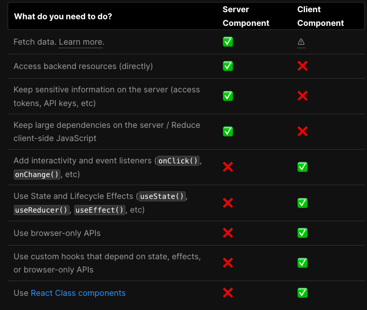

# NextJS Basic

## keyword
- client-side navigation
  - 같은 페이지에서 특정 부분만 re-rendering 하는 것
- Parallel Routes
  - 한 개 이상의 페이지를 동시에 렌더링
  - 이 페이지들은 같은 view에서 독립적으로 이동 가능
  - dynamic한 섹션, 가령 대시보드, 소셜 사이트의 피드 페이지
  - @folder convention 사용
- Intercepting Routes
  - 현재 레이아웃에서 브라우저 URL을 마스킹하는 동안, 새로운 route를 로드하는 것
  - 현재 페이지의 컨텍스트가 중요할 때 사용
  - 가령 하나의 태스크를 수정하는 동안 모든 태스크 보기, 사이드 모달에서 카트 열기, 피드에서 사진 확대
  - 폴더명에 (..)를 prefix로 하는 컨벤션
- Rendering Fundamentals
  - Rendering Environments
    - 흔히 아는 client, server에 대한 설명
  - Component-level Client and Server Rendering
    - React 18 이전엔 React에서 렌더링 방법으로 클라이언트만 지원
    - Next.js는 애플리케이션을 pages로 나누고, 서버에서 prerender 하는 방법을 제공
      - 대신 이건 추가적인 자바스크립트가 클라이언트에게 필요하게 됨.(초기 HTML interactive를 위해)
    - 이제 React는 컴포넌트 레벨에서 렌더링 환경의 선택을 지원함(클라이언트 Or 서버)
    - 컴포넌트들은 트리 형태로 관계가 구성되는데, 서버 컴포넌트 자식으로 클라 컴포넌트가 들어간다던지, 반대도 가능
  - Static and Dynamic Rendering on the Server
    - Next.js는 서버에서 렌더링을 최적화 하는 옵션을 제공. static과 dynamic
    - static
      - 서버 빌드 타임에 컴포넌트들(클라, 서버 컴포넌트)이 프리 렌더 됨. 
    - dynamic
      - request 타임에 컴포넌트들(클라, 서버 컴포넌트)이 렌더링됨
  - Edge and Node.js Runtimes
    - 서버에서 페이지가 렌더될 수 있는 런타임 2가지가 존재
    - Node.js
      - 디폴트 설정
      - 모든 Node.js API, 에코시스템의 호환되는 패키지들에 접근 가능
    - Edge
      - 웹 API 기반
  - When to use Server vs. Client Components?
    - 

  - Fetching Data on the Server
    - data fetching은 서버 컴포넌트에서 하는걸 추천함
  - Component-level Data Fetching
    - 이 모델에서 pages, layouts 내 데이터를 fetch 할 수 있음.
    - parent Layout은 child layout과 데이터를 주고 받는게 불가능. 각 레이아웃에서 필요한 데이터 Fetch 하는걸 추천
      - 동일한 데이터를 여러번 호출한다고 해도 NextJs는 요청에 대한 cache, dedupe을 통해 중복 Fetching을 피한다
  - Parallel and Sequential Data Fetching
    - parallel: 데이터를 동시에 로드. 로딩 시간 단축에 도움
    - sequential: 로딩시간을 늘지만 특정 케이스에 유용
      - 하나의 Fetch가 다른 fetch의 결과에 의존성을 가지는 경우
      - 다음 Fetch 전에 리소스를 저장하고 싶은 경우 
  - Automatic fetch() Request Deduping
    - 레이아웃, 페이지 트리에서 동일 데이터에 대한 여러번의 fetch가 있을 경우 cache와 dedupe가 지원됨
    - 캐시 라이프타임
      - server: 렌더링 프로세스가 끝날 때 까지
      - client: 세션동안
    - 참고로 Post 요청은 자동적으로 dedup 되지 않는다 
  - Static and Dynamic Data Fetches
    - 데이터의 종류엔 2가지가 있음.
      - static: 자주 변하지 않는 것. ex) 블로그 포스트
      - dynamic: 자주 변하고, 특정 유저에게 specific한 데이터. ex) 쇼핑 카트 리스트
    - static은 캐싱이 적용되고, dynamic은 그렇지 않다
    - static이 request 수도 줄이고, loading 퍼포먼스도 증가시키지만 dynamic이 필요할 때가 있다
      - 데이터가 유저 개인화된 경우
      - 언제나 최신 데이터를 읽고 싶은 경우 
  - Caching Data
    - nextjs는 캐시로 persistent HTTP cache를 사용한다. 이는 globally distributed 가능
  - Revalidating Data
    - 캐시를 제거하고 최신 데이터를 가져오는 방법
    - 2개 타입 존재
      - background: 일정 시간 간격으로 revalidate
      - On-demand: 업데이트가 있을 때만 revalidate
  - Streaming and Suspense
    - 렌더링된 Unit을 점진적으로 클라이언트에 stream하는 기능
    - 서버 컴포넌트이고, 데이터를 필요로 하는 nested layout이 있는경우, 데이터 필요없는 부분은 즉시 렌더링하고 데이터 필요한 부분은 로드 상태 표시